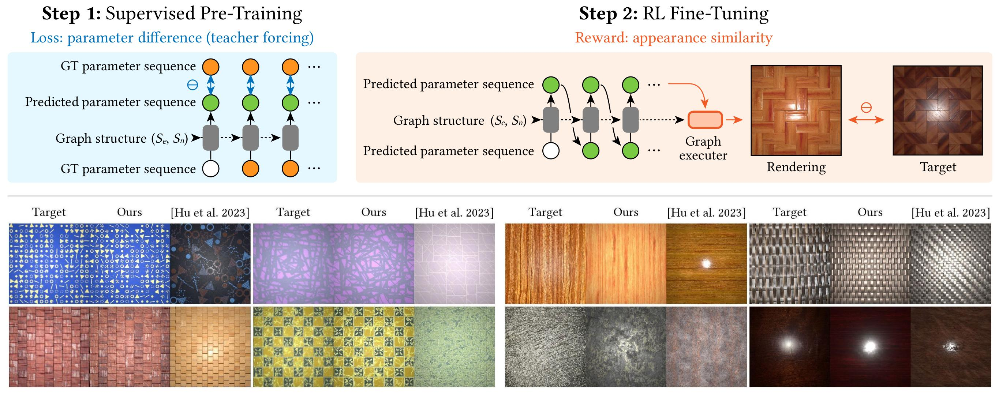

# MatFormer-RL

MatFormer is a generative model for procedural materials in [Adobe Substance 3D Designer](https://www.adobe.com/products/substance3d/apps/designer.html), with a primary focus on image-conditioned material graph generation.

This repository contains the source code for training and evaluating a conditional MatFormer as described in the "[*Procedural Material Generation with Reinforcement Learning*](https://dl.acm.org/doi/abs/10.1145/3687979)" paper (Li et al., SIGGRAPH Asia 2024).



Main contributors:
- [Paul Guerrero](https://paulguerrero.net/) - the original MatFormer implementation
- [Yiwei Hu](https://yiweihu.netlify.app/) - conditional generation capabilities
- [Beichen Li](https://people.csail.mit.edu/beichen/) - RL fine-tuning for node parameter prediction

### Important Notice

Our dataset and pre-trained model used for producing the results in the paper can not be released under Adobe's policy.
As an alternative, we will release the pre-trained and RL-fine-tuned weights of a sample model trained using published materials in [DiffMat](https://github.com/mit-gfx/diffmat). Please stay tuned for further updates.

## Installation

Clone this repository into your working folder (e.g., using the SSH method).
```bash
git clone git@github.com:adobe-research/ProcMatRL.git
```

### Python Environment Setup

Install the following required Python libraries with `conda` or `pip`:
```bash
# Create an environment in Anaconda
conda create -n matformer python=3.9
conda activate matformer

# Install basic prerequisites
conda install numpy scipy matplotlib pandas networkx imageio packaging tqdm scikit-image ordered-set ftfy regex tensorboard

# Install the latest PyTorch version compatible with PyG
conda install pytorch==2.4.1 torchvision==0.19.1 pytorch-cuda=12.1 -c pytorch -c nvidia

# Install PyG
conda install pyg=*=*cu* -c pyg
```

The following libraries should only be installed with `pip`:
```bash
# For node graph visualization
sudo apt install graphviz graphviz-dev
pip install graphviz pygraphviz

# Other prerequisites
pip install git+https://github.com/openai/CLIP.git
pip install opencv-python func-timeout lpips kornia
```

Install [DiffMat](https://github.com/mit-gfx/diffmat/) as an editable package following their instructions.
``` bash
# Additional packages for DiffMat
pip install taichi

# Install DiffMat
git clone git@github.com:mit-gfx/diffmat.git
cd diffmat
pip install -e .
```

### Substance Designer CLI Tools

Install Adobe Substance 3D Designer or a standalone distribution of Substance Automation Toolkit (SAT) and remember the **installation path** containing `sbscooker` and `sbsrender` executables. The path is required to reference these CLI tools for material graph evaluation.

## Training

As outlined in the SIGGRAPH Asia paper, the training process of a conditional MatFormer for node parameter prediction involves two stages: **supervised pre-training** and **RL fine-tuning**.

Each stage entails no more than running a Python script with a JSON configuration file which substitutes lengthy command line arguments. We have included starter JSON files in the `configs` folder.

> Note: Please double-check the JSON configuration file and make sure the arguments are correctly provided before kicking off with training.

### Supervised Pre-Training

Switch to the cloned repo.
```bash
cd /path/to/working/folder/ProcMatRL
```

Then, modify `configs/train_param_generator.json` as follows:
- Replace all occurrences of `/path/to/dataset` (not including quotes) with the actual path to the dataset.
- Replace all occurrences of `/path/to/result` with the result folder address.
- Change the `"devices"` field to specify training devices. For multiple GPUs, list the name of each device like `["cuda:0", "cuda:1", ...]`.
- Update `"batch_size"` to accommodate the GPU memory limit. The default value works for RTX 3090 24GB GPUs.
- Update `"lr_schedule_warmup"`, `"lr_schedule_annealing"`, and `"validate_interval"` accordingly if the batch size is changed. They are measured by training steps and thus scale inverse-proportionally to the batch size.

If you need to alter the remaining command line options, please refer to their definitions in `matformer/train_param_generator.py`.

The following command initiates pre-training:
```bash
python -m matformer.train_param_generator --config configs/train_param_generator.json
```

### RL Fine-Tuning on Synthetic Data Only

To fine-tune the pre-trained model using synthetic images only, modify `configs/train_ppo.json` as follows:
- Replace `/path/to/dataset` and `/path/to/result` with corresponding paths.
- Set `"sat_dir"` using the installation path of Substance Designer CLI tools.
- Set `"devices"` as the names of training devices.
- Adjust `"batch_size"` (the number of trajectories in each mini-batch during buffer replay) according to the GPU memory size.

The remaining command line options are defined in `matformer/train_ppo.py`.
```bash
python -m matformer.train_ppo --config configs/train_ppo.json
```

### RL Fine-Tuning on Synthetic and Real Data

Alternatively, you can fine-tune the pre-trained model using a combination of synthetic and real images. Simply modify `configs/train_ppo_real.json` instead following the same instructions as above.
```bash
python -m matformer.train_ppo --config configs/train_ppo_real.json
```

## Inference

Similar to training, the inference procedure also comprises several steps including parameter prediction, material rendering, image-space metric calculation, and differentiable post-optimization.

We have consolidated this workflow into a unified script `matformer/eval_graph_generator.py`, which is invoked likewise using a JSON configuration file.

### Configurations

The `configs/` folder contains two starter JSON configuration files for inference, where `eval_ppo.json` uses synthetic test images and `eval_ppo_real.json` uses real test images.

Pick a starter file per your use case and edit the configurations as follows:
- Replace `/path/to/dataset` and `/path/to/result` with corresponding paths.
- Set `"sat_dir"` to the installation path of Substance Designer CLI tools.
- Set `"devices"` as the names of inference devices. Note that only parameter prediction and differentiable post-optimization run on multiple GPUs.
- Update `"num_processes"` with the number of CPU cores to employ for multi-process material rendering.
- Change `"metric_batch_size"` to accommodate the GPU memory size. This setting controls the batch size when calculating image simlarities.

Please check out `matformer/eval_graph_generator.py` for additional command line options.

### Commands

Run one of the following commands at the root of this repo:
```bash
# Case 1: inference on synthetic images
python -m matformer.eval_graph_generator --config configs/eval_ppo.json

# Case 2: inference on real images
python -m matformer.eval_graph_generator --config configs/eval_ppo_real.json
```

## Result Structure

The result folder will be organized as the following if you set up training and inference according to the instructions above.

```
/path/to/result
├── eval/                               # Inference results
│   ├── ppo_param_generator_real/
│   │   └── images/
│   │       ├── 0_xxx/                  # Generated and optimized materials for each input image
│   │       ├── 1_xxx/
│   │       ├── 2_xxx/
│   │       └── ...
│   └── results/                        # Side-by-side visual comparison figures
├── finetune/
│   └── ppo/
│       └── ppo_param_generator_real/   # RL fine-tuning checkpoints
└── pretrain/
    └── models/
        └── param_generator/            # Supervised pre-training checkpoints
```

## Citations

We thank you in advance for citing the following MatFormer-related papers if our methodology or codebase contributes to your research project.

```bibtex
@article{li2024procedural,
  title={Procedural Material Generation with Reinforcement Learning},
  author={Li, Beichen and Hu, Yiwei and Guerrero, Paul and Hasan, Milos and Shi, Liang and Deschaintre, Valentin and Matusik, Wojciech},
  journal={ACM Transactions on Graphics (TOG)},
  volume={43},
  number={6},
  pages={1--14},
  year={2024},
  publisher={ACM New York, NY, USA}
}

@inproceedings{hu2023generating,
  title={Generating Procedural Materials from Text or Image Prompts},
  author={Hu, Yiwei and Guerrero, Paul and Hasan, Milos and Rushmeier, Holly and Deschaintre, Valentin},
  booktitle={ACM SIGGRAPH 2023 Conference Proceedings},
  pages={1--11},
  year={2023}
}

@article{guerrero2022matformer,
  title={Matformer: A generative model for procedural materials},
  author={Guerrero, Paul and Ha{\v{s}}an, Milo{\v{s}} and Sunkavalli, Kalyan and M{\v{e}}ch, Radom{\'\i}r and Boubekeur, Tamy and Mitra, Niloy J},
  journal={arXiv preprint arXiv:2207.01044},
  year={2022}
}
```

## License

The codebase is released under the [Adobe Research License](LICENSE.md) for **noncommercial research purposes** only.
